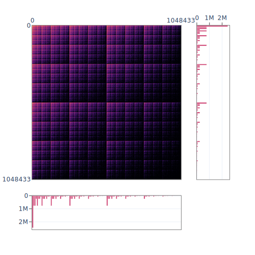

# Rmatter: A Fast, Space-Efficient, and Deterministic R-MAT Graph Generator

## Overview

Rmatter generates an [R-MAT graph](https://www.cs.cmu.edu/~christos/PUBLICATIONS/siam04.pdf) in a fast, space-efficient, and deterministic way.

- **Fast**: This generator was developed because existing tools were too slow to generate large graphs. Rmatter can generate an R-MAT27 graph (N=2^27, M=2^31) within 3 minutes on my laptop (much faster on many-core servers!).
    - If a sufficient number of cores are provided, the processing speed is mostly limited by the disk IO bandwidth.
- **Space-Efficient**: Rmatter can generate graphs that are much larger than the local RAM size by bounding the total memory usage.
    - This idea comes from another R-MAT graph generator [PaRMAT](https://github.com/farkhor/PaRMAT).
- **Deterministic**: No matter how many times you run it, it generates the same graph (thanks to [PCG random number generator](https://www.pcg-random.org)).
    - The output order is nondeterministic, but providing the same random seed will generate an identical graph.

## Usage

A compiler with C++20 support is required.

Clone and compile:
```sh
git clone https://github.com/s417-lama/rmatter.git
cd rmatter/
make
```

By default, `g++` is used for compilation (change `Makefile` if needed).

Generate an R-MAT20 graph (N=2^20, M=2^24) and save it as `rmat20.txt`:
```sh
./rmatter -n 1048576 -m 16777216 -o rmat20.txt
```

The following output will be displayed:
```
Generating an R-MAT graph with N = 1048576, M = 16777216 ...
Parameters: a = 0.57, b = 0.19, c = 0.19, d = 0.05
Random seed: 0
Estimated file size: 0.25 GB
12 threads will be spawned.
14.8448 GB of RAM will be used at maximum.
Chunk size: 174762 edges
Number of chunks: 97
[||||||||||||||||||||||||||||||||||||||||||||||||||||||||||||] 100%
Done.
The generated graph has successfully been written to: rmat20.txt
```

The output format is an edge list:
```console
$ head rmat20.txt
524288 598018
4736 66560
1088 2
786432 131361
270865 37388
25472 44304
791314 537
75795 73756
143488 295712
595970 313986
```

See help:
```console
$ ./rmatter -h
Usage: ./rmatter [options]
  options:
    -n : Number of vertices
    -m : Number of edges
    -a : Parameter a (default: 0.57)
    -b : Parameter b (default: 0.19)
    -c : Parameter c (default: 0.19)
    -r : Random seed (default: 0)
    -t : Number of threads
    -s : Fraction of memory space usage (default: 0.8)
    -o : Output filename (default: out.txt)
```

## Visualization

The `show_adj_matrix.py` script will visualize the adjacency matrix and histograms for graphs.

The following python packages will be required:
```sh
pip3 install "dask[array]" "dask[dataframe]" plotly
```

Visualize `rmat20.txt`:
```sh
python3 show_adj_matrix.py rmat20.txt
```



## Graph Format Conversion

Binary edge list format for [Gemini](https://github.com/thu-pacman/GeminiGraph) graph processing framework:
```sh
./converter -i out.txt -o out.binedgelist
```

## References

- [farkhor/PaRMAT](https://github.com/farkhor/PaRMAT): a multi-threaded RMAT graph generator
    - Rmatter is much simpler and faster, although PaRMAT has more capabilities (e.g., avoiding duplicated edges).
    - Rmatter's space-efficient execution took inspiration from PaRMAT.
    - PaRMAT is not deterministic.
